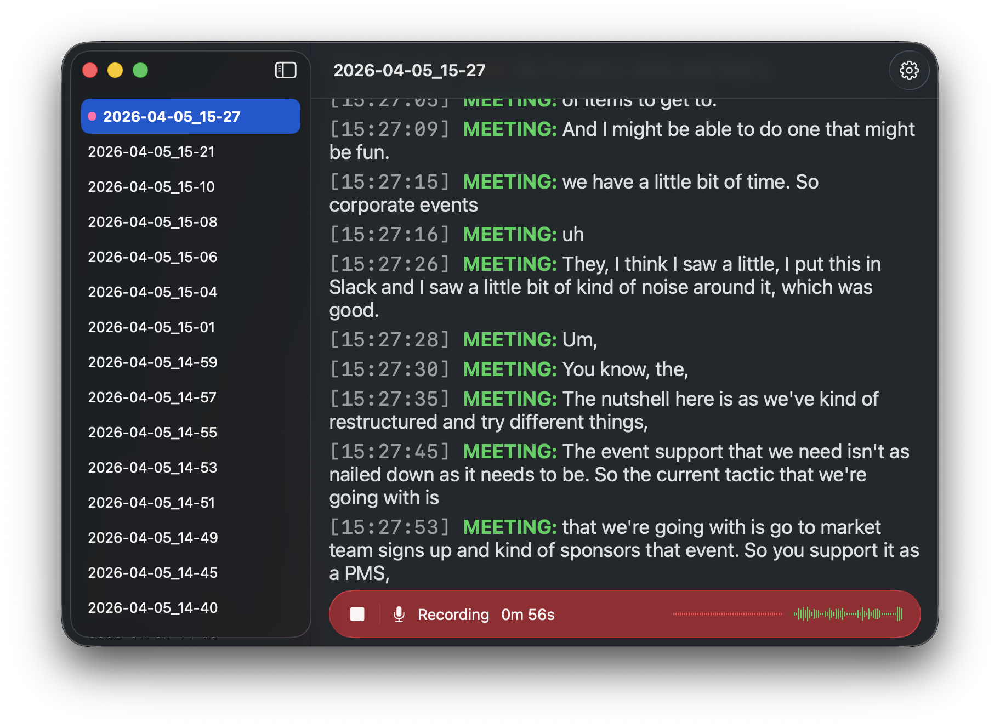
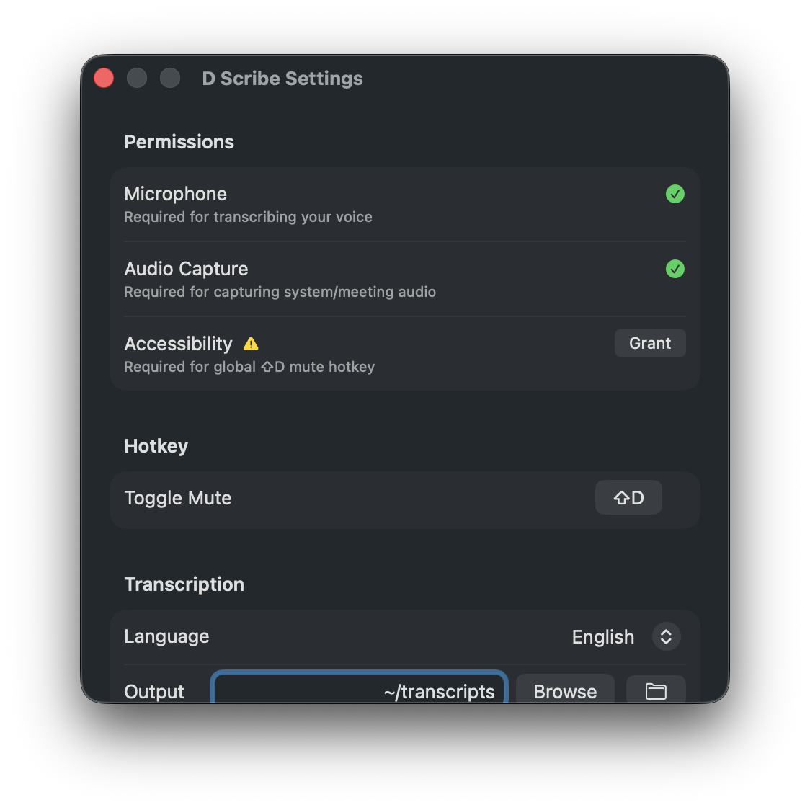

# D Scribe

Fully local meeting transcription app for macOS. Captures your mic and system audio simultaneously and produces a labeled, timestamped markdown transcript. No data leaves your machine.



- **YOU** channel: your microphone input
- **MEETING** channel: system audio (Zoom, Meet, Teams, etc.)
- Speech detection via Silero VAD (CoreML)
- Transcription via WhisperKit distil-large-v3 (CoreML/Metal)
- Markdown transcripts saved to `~/transcripts/` in real time
- Real-time waveform visualization for mic and system audio
- Configurable global mute hotkey (default ⌘D)
- Adjustable transcript font size (⌘+/⌘-/⌘0)

Requires macOS 14.2+ and Apple Silicon.

## Building

Requirements: Xcode 16+

1. Clone the repo and open the project:
   ```
   git clone <repo-url>
   cd "D Scribe"
   open "D Scribe.xcodeproj"
   ```

2. Xcode will automatically resolve the Swift package dependencies (WhisperKit, FluidAudio). Wait for package resolution to complete in the status bar.

3. Build and run (⌘R). The app opens as a windowed app with a sidebar listing past transcripts.

4. On first launch, the app downloads the Whisper model (~800MB) and Silero VAD model from HuggingFace. Progress is shown in the recording bar. Subsequent launches use the cached models.

## Permissions

The app will prompt for these on first use. You can also manage them in Settings:



- **Microphone** — to capture your voice
- **Audio Capture** — to capture meeting audio from other apps
- **Accessibility** (optional) — required for the global mute hotkey to work outside the app

## Usage

1. Click the **Record** button at the bottom of the transcript view
2. Speak into your mic — `YOU:` lines appear
3. Play or join a meeting — `MEETING:` lines appear
4. Click the mic icon or the area right of the divider to **mute/unmute** your mic (meeting audio keeps recording)
5. Click the **stop** button to end — transcript is saved to `~/transcripts/`

The recording bar shows a real-time waveform for both mic (red) and system (green) audio, along with a session duration timer.

### Sidebar

The sidebar lists all past transcripts sorted by date. Click to view, right-click to delete.

### Settings

Open via the gear icon in the toolbar (⌘,):

- **Hotkey** — configure the global mute hotkey (default ⌘D, accepts any key combo or standalone key)
- **Language** — transcription language
- **Output** — directory for saved transcripts
- **VAD threshold** — sensitivity for speech detection
- **Silence duration** — how long to wait after speech ends before transcribing
